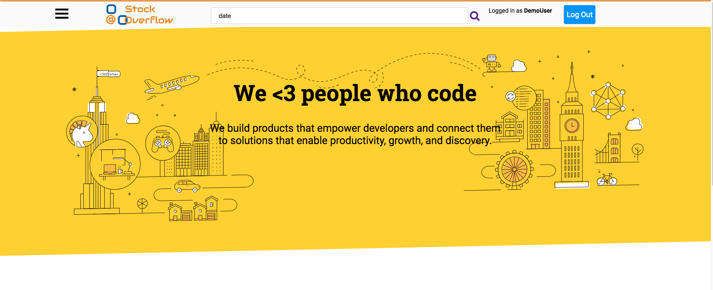

# Stock Overflow README

[Stock Overflow](https://stockoverflowku.herokuapp.com) is a place where developers could ask and answer questions related to coding.



Stock Overflow is a [Stack Overflow](https://https://stackoverflow.com) Clone.

## Features
* Ask Questions
* Answer Questions
* Search for Questions
* Upvote / Downvote Answers and Questions
  - Users can upvote/downvote questions or answers. They can also cancel their upvotes or downvotes. This mimics the actual feature on Stack Overflow. 

## Technologies
* Javascript
* Ruby on Rails
  - User authentication
* React
  - A Javascript library for building user interfaces.
* Redux
  - A Javascript library that manages application state.
* PostgreSQL
  - Backend Database
* CSS

### BCrypt
Used BCrypt for encrypting users' passwords.
```Ruby
def password=(password)
    @password = password
    self.password_digest = BCrypt::Password.create(password)
  end

def is_password?(password)
  BCrypt::Password.new(self.password_digest).is_password?(password)
end
```

### Redux workflow
Used all the essential parts of Redux such as reducers and thunk.
```javascript
import { createStore, applyMiddleware } from 'redux'
import thunk from 'redux-thunk';
import rootReducer from './reducers/root_reducer'

const configureStore = (preloadedState = {}) => {
  return createStore(rootReducer, preloadedState, applyMiddleware(thunk));
};

export default configureStore;
```

### Active Record
Used Active Record for making migrations. Active Record represents the models of the program. The layer of the system responsible for data and logic.
```Ruby
class CreateUsers < ActiveRecord::Migration[5.2]
  def change
    create_table :users do |t|
      t.string :username, null: false
      t.string :password_digest, null: false
      t.string :session_token, null: false  
      t.string :email, null: false
      t.timestamps
    end

    add_index :users, :username, unique: true
    add_index :users, :session_token, unique: true
    add_index :users, :email, unique: true
  end
end

```